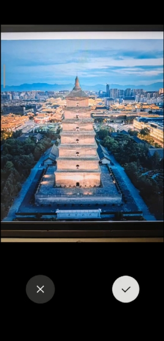

 

## 1. Project Overview

The main function of "Visualist" is to improve users' photography skills and aesthetics, so that customers can take more beautiful photos.

The main function of "Visualist" is to compare expert photos. After users upload their photos, the App recognizes the content, scene, light, person or object, and returns an expert photo taken in a similar scene, along with some expert suggestions. Users can improve their shooting skills by comparing their photos with expert pictures and expert suggestions provided by the App.

The Visualist also has some other functions, such as forum function and mall function. This is the main way the App monetizes.

 

## 2. User analytics

Visualist is aimed at people who want to take good looking photos and people who want to improve their photography. Our main users are young people.

### 2.1 User pain points 

These users have many pain points, of which two are the main ones. One is that they have no professional technology, and the other is that they have no professional equipment.

1. Awareness without technology: Professional shooting technology needs to be systematically studied and trained to master, if you have not learned the relevant knowledge, do not realize what technical and theoretical support good photos need, it is difficult to take high-quality photos. For example, mastering the skills of focusing, exposure, composition and so on can better grasp the moment, show the picture, highlight the theme and so on.
2. No professional equipment: although the current mobile phone camera performance is more and more powerful, but compared with professional photography equipment, there is still a certain gap. Lack of professional photography equipment, such as SLR, tripod, etc., will also affect the quality and effect of photography, such as in low light environment may appear noise or blur and so on

In short, if you want to take good photos, you need to have a certain amount of professional knowledge and technology, as well as high-quality equipment. However, good photography is not only about equipment and technology, but also needs artistic and aesthetic absorption, and needs to have a unique visual understanding and experience.

To solve these problems, users need to do the following things.

1. Learn professional knowledge and techniques: Understand the basic principles and techniques of photography, master the skills of focusing, exposure, composition, etc., by attending offline or online photography training, or by self-learning related knowledge and theories, such as obtaining professional knowledge through photography books, video tutorials, etc.
2. Practice shooting skills: Practice and practice, through the actual shooting process, you can gradually master shooting skills and improve photography. At the same time, you can also learn about the industry dynamics and get professional feedback by participating in photography competitions, sharing works and other ways.
3. Switch to professional equipment: If you want to shoot more professional photography, you can choose to buy professional photography equipment, such as SLR cameras, lenses, tripods, etc. However, before purchasing, we should fully understand and carefully compare, consider the actual needs of individuals, and weigh the cost performance and practicability of the equipment.
4. Enhance aesthetic and artistic absorption: Taking good photos and having artistic temperament of the photos are not necessarily the same, need to enhance aesthetic and artistic absorption, improve the unique visual understanding and experience, so as to better understand the work taken. You can look at other photographic works to understand different shooting angles and methods of expression.

In short, taking high-quality photos requires continuous learning and practice, as well as continuous acquisition of more technical and aesthetic knowledge. On this basis, the configuration of appropriate photographic equipment, in different scenes, can better achieve the purpose of shooting, there are higher quality works.

However, these requirements, "Visualist" can provide users with help.

### 2.2 Visualist 

In view of these user pain points, the App can provide users with services to solve difficulties.

First of all, we compare the most important functional expert chart.

This function allows customers to shoot close to the level of experts in a short time. This minimizes the impact of the user's lack of photography skills. In this process, customers don't have to learn for a long time, they just need to imitate. This function can provide users with a lot of help.

1. Learn excellent photography skills: Imitating master photography can learn master's excellent photography skills and shooting methods, so as to better master photography knowledge and skills. For example, imitating how masters compose, judge the light, capture the moment, etc., you can quickly master the skills, and use them freely in actual shooting.
2. Broaden your vision and expand your imagination: By imitating the master, you can broaden your vision, understand different styles and shooting ideas, improve your aesthetic and artistic quality, and stimulate your creativity and imagination.
3. Cultivate your own personality style: By imitating the master, you can find the style of photography you are interested in, and create your own unique style on this basis, so as to become a photographer with a unique personality.
4. Step out of your comfort zone: Imitating a master allows you to better step out of your comfort zone and challenge your abilities and creativity, thus further improving your shooting ability and level.

In short, by imitating the master shooting, you can better master photography skills, improve your artistic literacy and personality style, so as to constantly improve your photography level. In addition, in the process of imitation, you can also continue to learn the shooting ideas and styles of other photographers, appropriately add your own personality characteristics, and constantly innovate and break through, in order to better improve your photography level.

The mall will provide high-quality photography equipment.

These equipment are qualified certification, users can rest assured that bold purchase. This mall can provide users with some help.

1. Rich choice of goods: Excellent photography mall will provide a variety of photographic equipment, such as cameras, lenses, tripods, filters, etc., to meet the needs of photography enthusiasts, providing more shooting possibilities
2. High-quality product quality and after-sales service: "Visualist" to provide products, quality assurance, and will provide high-quality after-sales service, can ensure the quality of photographic equipment and after-sales problems to solve.
3. Competitive price: "Visualist" is able to provide a variety of high-quality photographic equipment and accessories at more competitive prices, and photography lovers can find products with higher cost performance in these malls.
4. Professional technical support and advice: "Visualist" not only provides products, but also gives professional technical support to photography enthusiasts, such as providing guidance, consultation, installation and commissioning services when purchasing, and provides some professional advice, such as recommending photography equipment and accessories with high cost performance according to customer needs. 	In short, "Visualist" provides photography enthusiasts with convenient, affordable, quality and service guarantee, and provides important support in photography outing, travel, shooting, etc., which can improve the shooting efficiency and quality of photography enthusiasts.

The forum system provides a place for photography enthusiasts to communicate.

Photography enthusiasts can register an account and exchange ideas with other users. They can also turn to professionals for help when they encounter difficulties. Users can get some benefits through the forum.

1. Exchange and learning: Photography enthusiasts can exchange and learn with other photography enthusiasts on the forum, share their own shooting experience and experience, get guidance and advice from others, so as to improve their photography skills and levels.
2. Get feedback: Other photography enthusiasts on the forum can provide helpful feedback and criticism to help photography enthusiasts find their shortcomings and make targeted adjustments and improvements to improve their photography quality.
3. Understand the industry dynamics: In the forum, photography enthusiasts often share industry dynamics, information and news, which helps photography enthusiasts to understand the latest equipment, shooting methods and photography skills and other aspects of knowledge, and constantly maintain their research and learning status.
4. Expand vision and creativity: photography enthusiasts in the forum will also hold shooting activities and competitions from time to time, so that different photography enthusiasts have the opportunity to communicate, interact, urge and interact with each other, so as to constantly expand their vision, inspire their creativity, tap their imagination and creativity, and continue to move forward in continuous practice and improvement.

To sum up, the photography forum is very helpful for photography enthusiasts to improve their photography skills. Exchange, learning and sharing in the forum can not only improve photography skills and levels, but also enhance the good contact and friendship between each other.

 

We have classified the different user groups. The user groups are roughly divided into three categories: beginner photographers, creative photographers, and aesthetic lovers. We will conduct different evaluation and recommendation for these three users, so as to achieve differentiation and individuation.

## 3. Industry analysis 

### 3.1 Potential 

The photography industry is trending well.

##### Large potential users. 

People have many scenes in their life that need to be photographed. For women, they need to shoot in love, marriage, travel, parent-child and other life scenes. Male users also have a greater demand for these emotional resonance. Here are the main reasons why.

1. Increasing visual demand in modern society: With the development of society and the improvement of people's cultural level, more and more people have increased their pursuit of beauty and aesthetic demand, and the photography market has become a way for them to express themselves.
2. Digital product development: With the popularity of digital products, photography has become more and more common, many people have digital cameras, smart phones and other digital products, photography market has established a strong digital foundation.
3. The photography industry has a wide range of applications: The photography industry has a wide range of applications, both for users to record memories, but also can be applied to many fields such as commercial advertising.
4. Segmented competition: the different application fields of the photography industry have led to segmented competition in the market. For customers in the market segment, photography companies can develop professional service strategies and positioning.

Therefore, the number of potential users in the photography market is huge. For photography practitioners, it is necessary to carefully analyze the preferences and needs of potential customers, formulate professional service strategies and innovative service concepts according to market characteristics, and constantly realize their own value and improve market competitiveness. At the same time, it is gratified that there are many more users waiting to be served in the photography market.

 

##### Now, the photography industry is gradually refining consumer groups to meet the individual needs of customers. 

Conventional and universal services are difficult to operate. Only by catering to the individual needs of consumer groups can they be favored by consumers. The following are the main reasons.

1. Changes in market demand: As the market becomes increasingly competitive, consumer demand in the photography market is gradually becoming diversified and personalized. Consumer groups have different needs and pursuits for the object, scene, style and form of photography.
2. Driven by the development of technology: With the continuous development of technology, the technical threshold of the photography industry continues to rise. Photography practitioners can provide more refined and personalized services by following up on the latest technology.
3. Competitive advantage of high-end services: Providing refined and personalized services can increase the competitiveness of photography companies, obtain more high-end customers, and form brand reputation and reputation.

The gradual refinement of consumer groups in the photography industry can produce many advantages

1. Meet the diversified needs of customers: refined consumption can more accurately meet the diversified needs of customers, and enhance the service awareness and service quality of photography companies from the perspective of customers
2. Improve the quality of service: To carry out personalized service requires practitioners in technology, service, personnel quality and other aspects of continuous improvement and excellence, so as to improve the quality of service, promote the rapid growth of enterprises.
3. Enhance the competitiveness of the industry: improve the quality of service and meet the individual needs of customers to help photography companies continue to grow, increase market share, enhance the competitiveness of the industry and development potential.

##### The products in the photography industry are generally increasing the added value. 

From mass service to personalized service. It has been a common trend to increase the process and number of services to get more profit. Here are the main reasons.

1. Changes in market demand: With the broadening of consumer vision and the improvement of cultural quality, consumers' demand for added value of products is gradually becoming diversified and personalized, and the photography industry is no exception.
2. The improvement of technology: with the rise of digital age and network technology, photography industry technology is common, bringing practitioners more technical realization possibilities, but also can improve the added value of products.
3. The change of consumer awareness: Now consumers pay more and more attention to service and experience, the photography industry has gradually begun to transform from traditional photography services to experience-based services, and improve the added value of products.

There are several advantages to the photography industry in increasing the added value of its products.

1. Improve product competitiveness: the increase of added value can reflect the differentiation of the product, improve the competitiveness of the product, and attract more consumers to choose the product.
2. Improve the value of the product: the increase in the added value of the product means the improvement of the quality of the product, which will improve the recognition and value of the product, and become one of the reasons for consumer choice.
3. Expand the sales channel: the provision of additional services can expand the sales channel of the product, make the product more attractive and develop new market demand.

### 3.2 Risks 

However, the photography industry is also gradually maturing, and the market competition is becoming more and more fierce.

 

##### High operating cost and low profit margin 

At present, there are more and more offline physical stores, and the competition is becoming more and more fierce, leading to the decline of service prices. While the rent of stores in cities is getting higher and higher, labor costs are becoming more and more expensive, and the cost of photography industry is rising. Under the influence of these two factors, more and more offline physical stores are not well managed and facing closure. The following are the main reasons.

First, the market is highly competitive. If the competition in the product market is fierce, the enterprise may need to increase the investment in marketing planning to gain more market share. At this time, the enterprise's marketing expenses are relatively high, which leads to the increase of operating costs and the decrease of profits.

At the same time, the price of raw materials. If the price of raw materials goes up, it will lead to an increase in production costs, which will eventually lead to an increase in operating costs.

In addition, labor costs go up. If enterprises invest more in labor costs, such as salary, insurance and welfare, it will also lead to an increase in operating costs.

There is also the aging of production equipment. If the production process and equipment used by the enterprise are relatively old, it may require relatively high maintenance and repair costs, which will also lead to higher operating costs of the enterprise.

 

##### Fierce regional competition 

In the investigation of Shishan Town, Nanhai District, Foshan City, it was found that in a region, the number of offline stores of photography service basically remained in a stable state, and the market supply and demand were close to saturation. In this case, there is an incompatibility between water and fire among the physical stores. Here are the main reasons.

1. Low barriers to entry: The photography industry has relatively low barriers to entry, and many people can be self-taught to enter the industry through study and practice. This leads to a lot of practitioners competing in the market, especially in a niche like wedding photography, where the competition can be even more intense
2. Technological innovation: With the development of science and technology, photography technology is constantly updated and innovated. This has become the motivation for many practitioners to continue to learn and progress, but it also leads to the lowering of the threshold of the photography industry and the intensification of competition.
3. Price war: thousands of photographic practitioners and photographic agencies compete in price, which makes many people gradually ignore other aspects of photographic service quality and service characteristics, and constantly reduce prices to obtain the commanding heights, resulting in an increasingly fierce market price war.
4. Market segmentation: in the case of market segmentation such as wedding photography, baby photography, and travel photography, many practitioners will compete with other practitioners in their fields of expertise, leading to fierce market competition.
5. The importance of customer word of mouth: the customer word of mouth in the photography industry has a very large impact on practitioners. Such as bad word of mouth or low evaluation, may lead to the loss of customers or unable to recruit new customers, which makes practitioners pay more attention to service quality and service experience.

In general, there are various reasons for the fierce competition in the market area. Due to the low threshold, fast technological update, market segmentation and other reasons, the competition in the photography industry is becoming increasingly fierce, which also requires practitioners to improve their own strength and service quality, and enhance competitiveness.

 

##### Lack of online promotion experience and awareness of online marketing 

Traditional photography services are carried out offline, which is why the number of customers grows slowly. Here are the main reasons.

1. Traditional marketing thinking: Since the photography industry is a traditional entity industry, many practitioners rely less on online marketing, and traditional marketing thinking may still dominate, which leads to a lack of experience in online promotion.
2. Company scale: many photography agencies or practitioners are small in scale and lack resources to carry out more comprehensive and long-term online promotion, which also causes the relative weakening of online marketing awareness.
3. Lack of professional skills and knowledge: many photography practitioners lack enough professional skills and knowledge on how to carry out online promotion and how to choose the right social media and online promotion tools, which leads to relatively weak experience in online promotion.

The consequence of the weak experience in online promotion and insufficient awareness of online marketing in the photography industry is that under the current trend of rapid development of digital sharing platforms, photography companies and practitioners will lose the opportunity to promote themselves on online platforms, and many potential customers may miss out on suitable photography services because they cannot find photography agencies. At the same time, photography agencies or practitioners lag behind the industry trend, will not be able to adapt to the fast-paced competition in the market environment.

##### Lack of brand influence 

There are few influential brands in the photography industry, and most of them are ignored. The following are the main reasons.

1. Product homogeneity: The photography industry has a serious product homogeneity, and it is difficult to obtain a memorable and lasting impression through product differentiation and characteristics, which is also difficult to establish brand influence.
2. Lack of creativity: Creativity and innovation ability is the key to establish brand influence. However, the photography industry currently has many practitioners whose photography works lack unique design, and annual events are often repetitive, which also leads to a lack of brand influence.
3. Lack of publicity: The publicity related to the brand is insufficient in the industry, unable to form enough brand advantages and let more people know about the brand, and lack of enough promotion channels, unable to quickly build brand exposure and fans.

The consequence of the lack of brand influence in the photography industry is that in the face of market competition, photography practitioners are difficult to form uniqueness or enhance brand competitiveness, difficult to attract the attention of high-value customers, affecting the long-term development of enterprises and business scale expansion.

## 4. Product function 

### 4.1 Shooting process and functions 

Shooting is one of the basic functions of "Visualist". Data shows that 60% of the "Visualist" pictures are taken by users, and 40% are imported pictures. It can be seen that the utilization rate of shooting function is very high.

Shooting is divided into photo shooting and video shooting. Photo shooting process: adjust the camera properties, click the "shoot" button, then the picture is successfully shot, the user can re-shoot, save.

#### 4.1.1 Detail description of shooting function

1. Click the shooting page, press the camera button to enter the shooting page, press the album button to enter the album page. （figure 4.1）

 

figure 4.1

2. Select the right Angle and composition and press the shoot button. （figure 4.2）

 

figure 4.2

 

3. Here is the page to confirm the photo. Press "√" to confirm the photo, press the back sign to take it again, and press "×" to return to the start page. After confirming the photo, users can send the photo to the platform for expert picture comparison, or send the photo to the forum for sharing with the vast number of netizens. （figure 4.3)

 

figure 4.3

#### 4.1.2 Detailed introduction of photo album function 

If you select the album button, you can select photos from the album of the phone, and then follow the steps similar to shooting. （figure 4.4）

 

figure 4.4

#### 4.2 Mall function introduction 

In the mall, you can see a variety of products recommended by "Visualist". If you see something you like, you can click on it to see the details, and then choose to add it to your cart or buy it. (figure 4.5)

 

figure 4.5

### 4.3 Forum Function Introduction 

In the forum, users can view the forum shared by other users, and also share their own photos and thanks on the forum.

 

#### 4.3.1 View other forums

Users can click on the forum screen to view forums shared by other users. (figure 4.6)

 

figure 4.6

#### 4.3.2 Send function 

Click the Development Forum button, select the photo you want and add the text, then click Publish. Then you can create your own post. (figure 4.7)

 

 

figure 4.7

#### 4.4 Personal Interface 

In the personal interface, users can view many basic app functions. For example, my work, history, review progress, help feedback, Settings and other functions. (figure 4.8)

 

figure 4.8

### 4.5 Encapsulation of shooting functions 

Determine if you have camera permissions first.(figure 4.9)

 

figure 4.9

 

If not, apply for camera permissions. (figure 4.10)

 

figure 4.11

1. Call launcher.launch("image/*") to open the image selector and select an image. (figure 4.11)
2. Get the selected image Uri and save it in Constants.mPictureUrl.
3. Use the MediaStore. Images. Media. GetBitmap () according to the Uri Bitmap, preserved in the mPicture.
4. Use the uriToFile () according to the Uri file, the file path in the worksPicturePath.
5. Call toCameraResultFragment() to jump to the Fragment that displays the picture.

 

figure 4.11

 

Initialize the instance of the search image.

 

figure 4.12

1. In the IO thread, open the input stream inputStream corresponding to Constants.mPictureUrl.
2. Create the byte array output stream byteArrayOutputStream and read and write the data in the inputStream to the byteArrayOutputStream.
3. Convert byteArrayOutputStream to byte array file.

4 Upload file for face recognition using similarSearch API of Face ++.

5. If the recognition result res has result, get the brief(image Url) of the first recognition result.
6. Download the picture using brief and save it to the Pictures folder on SD card. The file name is current time in milliseconds +.jpg.
7. If the download is successful, use BitmapFactory to read the local picture file and display it on ImageView in the Main thread and hide the progress bar.

 

### 4.6 Forum Function Encapsulation 

ForumFragment.Kt - Forum home page

Load forum data(figure 4.13)

 

figure 4.13

The forum page is nested using RecyclerView and RecyclerView has a horizontal sliding list for each vertical sliding list.

The adapter logic for RecyclerView is in VerticalAdapter.Kt

Forum add data EditActivity.kt

Click the button to take a photo with the system camera and save the photo results. (figure 4.14)

 

 

figure 4.14

Finally get the input content of the post and save the photo to the database. (figure 4.15)

 

figure 4.15

 

figure 4.16

## 5. Marketing channels 

There are four main marketing channels for Visualist. They are social media platforms, celebrity endorsements, partnerships with influential brands, and organizing photo competitions.

 

### 5.1 "Visualist" in social media platforms 

There are many social media platfroms like instangram, facebook, wechat, Douyin, XiaoHongshu, Weibo and so on. We have official accounts in these platforms. The main marketing methods are as follows.

1. Building a brand presence on social media: Visualist can build a brand presence by Posting valuable content such as user stories, professional tips, etc., on social media platforms.
2. Active social media: Visualist participates in discussions on hot topics, replies to users, etc., on social media to expand brand awareness and promote the participation of more users.
3. Broaden channels with social platforms: "Visualist" makes use of functions such as advertising and SMS push on social platforms to expand brand exposure and increase user visits and downloads.
4. Social media conversion: "Visualist" converts fans and users on social media to bring these users to its App.
5. Take advantage of social media's UGC: Visualist can take advantage of social media's UGC (user Generated content) by calling on users to take photos or create short videos using their own software and share them on social media platforms.
6. To sum up, "Visualist" entering the social platform for marketing needs to establish a stable brand image, and at the same time, actively participate in social media interaction, expand brand exposure, and improve user engagement and usage. Promote the marketing and development of photography software by means of UGC advantages and advertisement delivery of social media platforms.

 

### 5.2 Cooperate with some celebrities or Internet celebrities 

Especially some professional photo bloggers, we will invite them to use and evaluate "Visualist". If they find it useful, they will introduce it to their followers. That way, we can get a whole bunch of potential users. Here are the main advantages.

1. Enhance brand influence: Endorsements with celebrities can bring more exposure and enhance the influence and awareness of the brand.
2. Improve the recognition and trust of the product: Following the worship and belief of the star, users can have more recognition and trust of the product.
3. Customer base expansion: Cooperating with stars to endorse can attract a wider range of target users and expand the customer base of products.
4. Establish a personalized image: you can choose to cooperate with stars related to the field of photography, such as a star who shoots documentaries or photography works, to establish a personalized image and improve attractiveness.

 

### 5.3 Cooperate with influential brands 

Ask them to help promote and publicize the Visualist, so as to enhance the influence of "Visualist" and make consumers choose our App first. Here are the main advantages.

1. Increased brand image and awareness: Partnering with an influential brand allows Visualist to gain greater visibility, which in turn raises the brand's profile and increases consumer recognition and trust in the brand.
2. Expand the consumer base: Cooperating with influential brands can also attract more consumers, expand the consumer base, and increase sales and market share.
3. Absorb brand value: brand cooperation can absorb the value of influential brands, such as brand culture, brand image, etc., so as to improve the brand value of "Visualist".
4. Sharing resources: Brand cooperation can also share their own resources, such as market, users, technology, sales, etc., to realize the complementary advantages of both parties and promote the common development of both parties.

However, while cooperating with influential brands, we will take into account issues such as brand image, target market, product differentiation, etc., in order to avoid negative impact of cooperation on brand image.

 

5.4 Organize or sponsor online photo contests. In the initial stage, the influence of "Visualist" is low, and we will sponsor some large competitions to enhance the brand influence. After accumulating a certain number of users, we will hold online photography competitions and ask some well-known professionals to participate in them, so as to enhance our influence.

## 6. Product advantages 

### 6.1 Personalized service 

Each user receives a personalized service. Users can upload the photos they have taken to the Visualist, which will provide an expert drawing of the same scene for the user's photos, along with suggestions for changes. This allows each user to have a different service, avoiding the cookie-cutter service offered by most products on the market. "Visualist" differentiated services for customers can better meet the needs of customers. Here are the main advantages.

1. Meeting individual needs: "Visualist" personalized service is a service that is tailored according to the special needs of customers, and can provide personalized solutions and customized services according to the requirements of customers to meet their special needs.
2. Provide a better experience: "Visualist" personalized service can provide a better experience, customers can customize their own shooting scenes and requirements, so as to obtain better shooting results, and can enjoy "Visualist" professional services.
3. Improve brand value: Personalized service can improve brand value, provide unique and advanced customized services for photography services, can bring good reputation and reputation for "Visualist", enhance the market value and competitiveness of "Visualist".

In general, "Visualist" personalized service can meet the special needs of customers, provide more excellent shooting experience and excellent problem solutions, enhance brand value and market competitiveness, I believe that in the future "Visualist" personalized service will be more promoted and applied.

 

### 6.2 Fine customer 

Facing entry-level photographers, creative photography is, and aesthetic lovers, "Visualist" will offer some different service recommendations. For beginning photographers, "Visualist" will recommend some simple, cheap and used photography equipment, as well as courses on basic photography knowledge. For creative photographers, they have their own unique understanding of photography, so Visualist will reduce the recommendation of simple photography equipment and basic photography courses. Instead, professional photography equipment will be recommended, such as waterproof equipment for photographers who like to shoot the ocean, photography drones for photographers who like to shoot panoramic city views, and ropeways and stabilizers for photographers who like to shoot moving scenes. We will recommend different products for creative photographers' hobbies. For aesthetic lovers, Visualist will recommend less photographic equipment and more photo collections. Aesthetic lovers will receive recommendations for photography exhibits by various masters. Here are the main advantages.

1. Meet customer needs: Refined customer service can better understand the needs of customers, so as to provide professional photography services that are more in line with customer requirements, and can tailor the most suitable service plan for customers to fully meet customer needs.
2. Clear customer preference: Fine customer service can make the "Visualist" better understand the user's aesthetic, preference, style and other aspects of the needs, so as to provide professional guidance and suggestions in time, so that users are more satisfied and comfortable.
3. Improve customer satisfaction: Refined user service can enhance user satisfaction, so as to promote user referral, user's trust and support for "Visualist" can enhance the credibility and reputation of "Visualist", to achieve a virtuous circle effect.
4. Get user word of mouth: When the user's satisfaction with the service is high, they will recommend by word of mouth to bring more users to the "Visualist", thus speeding up the pace of development of "Visualist" and improving the competitiveness of enterprises in the industry market.
5. Security: By refining user services, enterprises can better carry out reasonable planning and resource allocation, so that business can be carried out more smoothly and systematically, and the risk of customer complaints can be reduced.

In general, refined user service can bring multiple advantages in the photography industry, such as improving user satisfaction, obtaining user reputation, etc. These are important means to improve the competitiveness and performance growth of "Visualist", and also one of the important ways to enhance the "Visualist" brand value.

 

### 6.3 Diversity of services 

Visualist offers both regular and special services to its clients. Regular services are for the general public, including expert comparison charts, courses, equipment, etc. Special services are tailored to individual needs, including one-to-one online guidance on shooting techniques from experts. We will develop some other features in the future. Here are some examples. According to users' requirements for shooting scenes, we will provide users with equipment, such as reflector, green cloth, ropeway, drone, waterproof roll, lifting column, etc. It is also possible to launch the service of field shooting led by masters to help users enjoy the process of shooting more.

 

### 6.4 Business approach 

"Visualist" takes a combination of online and offline approach. In order to deal with various problems of offline stores, as well as reduce costs, we put the main service mode online. There are two advantages in this way: lower the rent of the store and reduce the operating cost. Second, it avoids the geographical limitations of the traditional photography service industry, expands the scope of service, and promotes it to the whole city and even the whole province more quickly.

 

### 6.5 Cooperate with big-name IP 

We will actively cooperate with the IP field to join its industry through unique features. Give full play to the influence of big-name IP to promote the "Visualist" App.

 

## 7. Business model

### 7.1 Attracting customers 

Our expert graph comparison feature is a very new feature, and it is a free feature. It can meet the needs of a large number of photography enthusiasts, thus attracting photography enthusiasts to use "Visualist".

1. Attract a large number of users to try it out: "Visualist" attracts users by offering some free features that make users consider buying full-featured software next, thus attracting a large number of users to try and use it.
2. Reduce the cost of user purchase: "Visualist" provides free functions to attract users, so that users feel the advantages and convenience of the software, users are more easily persuaded to buy the full-featured software, and can also reduce the cost of user purchase.
3. The effect of marketing: "Visualist" provides free functions to expand the brand influence and marketing scope, expand the brand influence through free functions, and then drive sales.
4. Improve user experience: "Visualist" provides free functions to let users better understand the details of the use of the software, operation methods, etc., in order to improve the familiarity and convenience of users to the software, so as to better user experience and improve user satisfaction.
5. Customer stickiness: Free functions can attract different user groups and make them like and trust the software. With the deepening of use and understanding of the software, more users will like the software, thus improving the stickiness of customers.

In general, "Visualist" attracting users with free features is a good marketing strategy, which can enhance brand influence, improve user experience, increase user adhesion, and in turn increase sales opportunities and revenue.

 

### 7.2 Online shopping and advertising 

The mall has "Visualist" merchants' own stores and merchants' settled stores. In the mall, the Visualist will provide classes, equipment and other services. After we refine our customers, we can promote them to better meet their individual needs.

1. Mall sales: "Visualist" can set up an online mall to provide users with photography equipment, books, clothing and other products related to photography. The platform can cooperate with the suppliers and get a commission on the sales from them, and this method can provide a good profit for the photography platform.
2. Advertising: Visualist can place ads on its own website, APP and other platforms, provide advertising services to advertisers, and charge advertising fees according to the number of clicks or displays, which is a relatively mature business model.
3. Membership subscription: "Visualist" can provide users with more high-quality services and resources, and charge membership fees, such as video courses, high-quality photo galleries, etc. This method is a good source of income.
4. Photography services: "Visualist" can also provide photography services, offering users close-up shots, photography classes, event photography services, etc.
5. To sum up, "Visualist" can earn profits through various ways such as shopping malls and software, and provide better photography services and experience, which is convenient for the long-term development of "Visualist".

 

### 7.3 Combination of online services and offline services

At present, we are in the development stage and have already realized the main functions. After attracting a large number of users, we will add offline service projects and increase revenue.

 

## 8. Team members 

Chen Peizhang, Li Ziang, He Zihao, Xu Mingyang

 

## 9. Development planning 

The development of "Visualist" will have three stages, which are to realize basic functions, realize personalized functions, and realize the combined development of online stores and offline stores.

1. The first stage is to realize basic functions, we will improve the expert picture comparison function, mall function and forum function. Fix App bugs through testing and user feedback. The duration of this phase is about three to five months
2. The second stage is the implementation of personalized functions, we will refine the users and recommend personalized services. The duration of this phase is about five to seven months.
3. The third stage is the combination of online and offline stores. After we complete our online functions, we will target offline and expand our revenue programs. That phase will happen in about a year.

## 10. Summary 

We believe our app has a clear target user persona, an effective marketing strategy, a unique sales proposition and multiple revenue streams. We are confident that "Visualist" will be a huge success in the photography market. Thank you for your time and consideration.